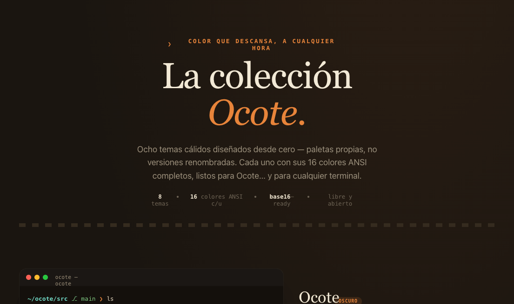

<div align="center">


# Ocote Themes

> Ocho paletas de color diseñadas desde cero — cálidas, con alma de lumbre. Para Ocote y para cualquier terminal.

[](https://github.com/tinted-theming/home)
[](LICENSE)



</div>

---

## Temas

| Tema | Tipo | Descripción |
|------|------|-------------|
| **Ocote** | 🌑 Oscuro | Carbón y lumbre. La firma de la casa. |
| **Brasa** | 🌑 Oscuro | Rescoldos al rojo. Cálido e intenso. |
| **Bosque** | 🌑 Oscuro | Verde de monte y resina. |
| **Noche** | 🌑 Oscuro | Azules profundos para la madrugada. |
| **Papel** | 🌕 Claro | Tinta sobre papel cálido. |
| **Tinta** | 🌑 Oscuro | Casi monocromo. Negro tinta, acento brasa. |
| **Mezcal** | 🌑 Oscuro | Agave y oro. Terroso y dorado. |
| **Cacao** | 🌑 Oscuro | Chocolate amargo y ámbar. |

---

## Instalación por terminal

### Alacritty

Copia el archivo a tu carpeta de temas y referéncialo en `alacritty.toml`:

```toml
import = ["~/.config/alacritty/themes/ocote.toml"]
```

Archivos disponibles en `dist/alacritty/`:
```
ocote.toml  brasa.toml  bosque.toml  noche.toml
papel.toml  tinta.toml  mezcal.toml  cacao.toml
```

### Kitty

Copia el archivo a `~/.config/kitty/` e inclúyelo en `kitty.conf`:

```conf
include themes/ocote.conf
```

Archivos disponibles en `dist/kitty/`.

### Ghostty

Copia el archivo a `~/.config/ghostty/themes/` y actívalo:

```
theme = ocote
```

Archivos disponibles en `dist/ghostty/` (sin extensión, como requiere Ghostty).

### WezTerm

```lua
-- en tu wezterm.lua
local colors = require('ocote-themes.wezterm.ocote')
config.colors = colors
```

Archivos disponibles en `dist/wezterm/`.

### Windows Terminal

**Un solo tema:** abre `Configuración → Abrir JSON` y agrega el contenido de `dist/windows-terminal/ocote.json` dentro del array `"schemes"`.

**Todos los temas de una vez:** usa `dist/windows-terminal/ocote-all.json` — contiene los 8 esquemas en un solo array listo para copiar.

### iTerm2

Abre iTerm2 → `Preferences → Profiles → Colors → Color Presets → Import…` y selecciona el archivo `.itermcolors` de `dist/iterm2/`.

### VS Code / Cursor

> Próximamente — pendiente de publicar en el marketplace. Mientras tanto, usa la [extensión base16 de tinted-theming](https://github.com/tinted-theming/tinted-vscode).

### Con tinted-theming (cualquier otra app)

Las fuentes base16 viven en `schemes/`. Puedes usarlas con [tinty](https://github.com/tinted-theming/tinty) para generar configuraciones para cualquiera de las [200+ apps compatibles](https://github.com/tinted-theming/home#supported-schemes-and-templates):

```sh
# instalar tinty
cargo install tinty

# apuntar al repo de schemes
tinty install --schemes-source https://github.com/Teshre/ocote-themes

# aplicar un tema
tinty apply ocote
tinty apply mezcal
```

---

## Estructura del repo

```
ocote-themes/
├── schemes/                  ← fuente de verdad (base16 YAML)
│   ├── ocote.yaml
│   ├── brasa.yaml
│   ├── bosque.yaml
│   ├── noche.yaml
│   ├── papel.yaml
│   ├── tinta.yaml
│   ├── mezcal.yaml
│   └── cacao.yaml
│
├── dist/                     ← generados (no editar a mano)
│   ├── alacritty/            .toml
│   ├── kitty/                .conf
│   ├── ghostty/              (sin extensión)
│   ├── wezterm/              .lua
│   ├── windows-terminal/     .json + ocote-all.json
│   └── iterm2/               .itermcolors
│
├── preview/
│   └── gallery.png           ← generada desde Ocote Themes.html
│
└── README.md
```

---

## Filosofía de color

Estas paletas **no son versiones renombradas de esquemas existentes**. Parten de una dirección propia: calor, contraste contenido y una paleta que no cansa. La idea central:

- **Fondos cálidos** — carbón con toque café, no gris frío.
- **Acento ember** — naranja brasa como color protagonista, en lugar del púrpura o el azul que domina la mayoría de terminales.
- **Saturación moderada** — colores que se leen bien 8+ horas seguidas.
- **Cohesión interna** — los 8 temas son familia, no colección aleatoria.

---

## Contribuir

¿Quieres añadir soporte para otra terminal o sugerir un ajuste de color?

1. Edita el `.yaml` en `schemes/` (nunca en `dist/` — esos se regeneran).
2. Abre un PR con los nuevos archivos en `dist/`.
3. Si añades un formato nuevo, documenta la instalación en el README.

---

## Licencia

MIT — úsalos como quieras, en lo que quieras.

---

*Hecho con lumbre por [Teshre](https://github.com/Teshre) · parte del proyecto [Ocote](https://github.com/Teshre/Ocote)*
